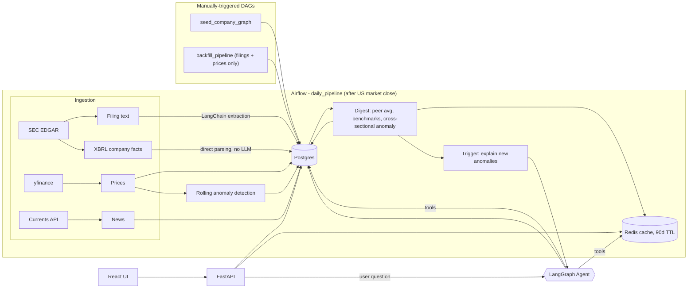

<p align="center">
  
</p>

<h1 align="center">YieldLine</h1>
<p align="center"><em>Catch unusual stock moves, uncover what drove them, and ask anything about your companies.</em></p>

[](https://opensource.org/licenses/MIT)

## What this is

I used to check the stock market most days and repeat the same cycle: scan a handful of companies I care about, and whenever something moved more than expected, dig around manually to figure out why - earnings release, external events, or a competitor's earnings call.

YieldLine automates that loop. It tracks a curated graph of companies (currently semiconductor/adjacent-tech - nothing about the design is specific to that sector), ingests filings, prices, and related news daily, flags statistically unusual price moves, and uses an LLM agent to explain *why*, grounded in the company's own filings, recent news, and its relationships to other tracked companies (suppliers, competitors, customers).

## Architecture



- **Ingestion & processing** - one Airflow DAG (`daily_pipeline`, scheduled after US market close) handles filings, prices, news, extraction, and anomaly detection end to end, skipping anything already processed. Two additional manually-triggered DAGs handle one-time setup: seeding the company graph from YAML, and backfilling historical filings/prices for newly added companies.
- **Extraction** - filings are classified and parsed into structured fields (guidance, named customers/competitors, capex commentary) via LangChain + Gemini, rate-limited against the free-tier API quota.
- **Anomaly detection** - two independent signals, both persisted for later lookup, not just same-day: a rolling z-score against each company's own history, and a same-day cross-sectional z-score against all tracked companies.
- **Digest** - daily cross-company snapshot: each company's return vs. its industry peers and sector benchmarks (SOXX/SMH/SPY), cached in Redis with a Postgres fallback beyond the cache window.
- **Agent** - one LangGraph agent, tool-calling over filings, news, prices, and the company graph, used two ways: automatically to explain newly detected anomalies, and interactively via the frontend's chat, where it also picks up whichever company is currently selected in the UI.
- **API / Frontend** - FastAPI (OpenAPI-documented) + a minimal React UI: company list with return/anomaly highlighting, a price chart, and a chat interface into the agent.

## Tech stack

Python, FastAPI, LangChain / LangGraph, Airflow, PostgreSQL, Alembic, Redis, Docker, React, TypeScript, SQLAlchemy, Pydantic, Pytest.

## Running locally

1. Copy `.env.example` to `.env` and fill in the required keys and variables. Do the same for `backend/api/.env.example` and `airflow/.env.example`.

2. Build and run all the necessary docker images and containers by running the following:

    ```bash
    make app-image dev-rebuild && cd airflow; docker compose up -d --build; cd ..
    ```

    This should start Postgres, Redis, the FastAPI backend (served by Uvicorn), and airflow.

3. If you want to add/remove/edit companies and their relations, you can do that in ` backend/src/stock_news/graph/companies_graph.yaml`. After that, run `make sync-companies` and trigger the `seed_company_graph` DAG to populate Postgres DB.

4. Frontend: `cd frontend && npm install && npm run dev`.

5. API docs at `http://localhost:8000/docs` once the backend is running.

This will start running a daily DAG from now on. If you want to backfill to have more context and be able to use the app to its full extend right away, you can manually trigger the backfill DAG via the airflow UI. `airflow/dags/backfill_pipeline.py` has a `BACKFILL_YEARS` variable that is set to 1, but can be increased (note: the API used to get the filings' contains a minimum of 1 year of history or 1,000 filings, whichever is more. From empiric experimentation, it seems like most companies will have far more than 1 year of history, since 1,000 filings in one year is a huge amount. 5 years probably will still cover almost all companies, but even those that do not simply won't be filled). 

A Bruno collection (`bruno/`) is included for exercising both the app's own API and the external APIs (EDGAR, Currents News) directly.

After restarting you PC, run `make api-up` and `cd frontend && npm run dev` to start the Uvicorn API and Vite development servers.

## Known limitations / open work

Tracked as open issues:

- **AWS migration** - currently local-only (docker-compose); MWAA/ECS/RDS migration is scoped but not started.
- **Bring-your-own API key** - currently uses a single shared LLM key; supporting per-user keys is planned.
- **Pending-edges automation** - filings mention customers/competitors not yet in the graph; promoting those into tracked relationships is still a manual review step.
- **6-K classification** - not yet implemented (foreign private issuers' interim filings).
- **FX conversion** - non-USD reported financials aren't yet normalized to USD for cross-company comparison.
- **News dedup precision** - cross-outlet duplicate articles and company-relevance matching could be tighter.
