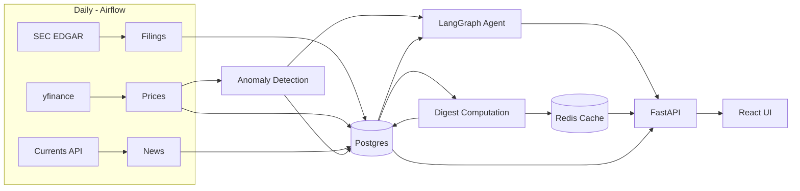

```mermaid
flowchart LR
    subgraph Ingestion [Daily - Airflow]
        EDGAR[SEC EDGAR] --> Filings
        YF[yfinance] --> Prices
        News[Currents API] --> NewsData[News]
    end
    Filings --> PG[(Postgres)]
    Prices --> PG
    NewsData --> PG
    Prices --> Anomaly[Anomaly Detection]
    Anomaly --> PG
    PG --> Digest[Digest Computation]
    Digest --> Redis[(Redis Cache)]
    Digest --> PG
    Anomaly --> Agent[LangGraph Agent]
    PG --> Agent
    Agent --> API[FastAPI]
    Redis --> API
    PG --> API
    API --> Frontend[React UI]
```
