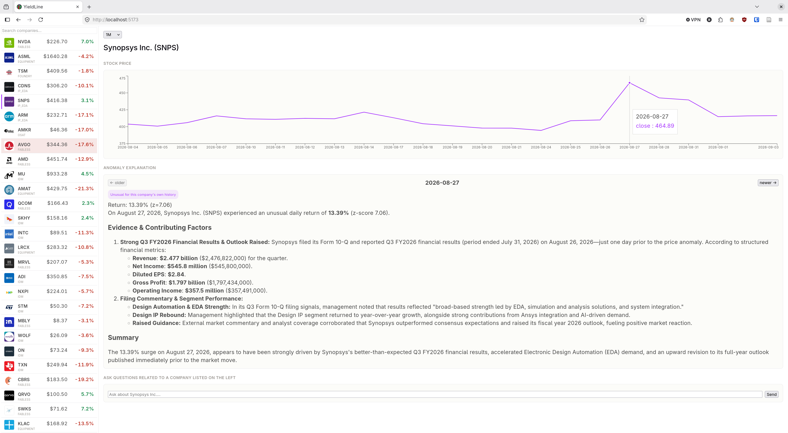
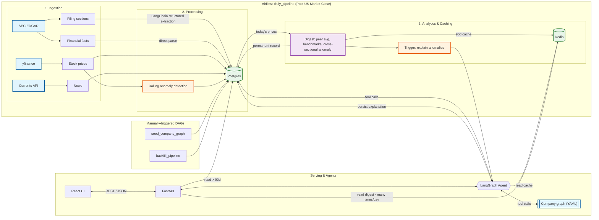

<p align="center">
  
</p>

<h1 align="center">YieldLine</h1>
<p align="center"><em>Catch unusual stock moves, uncover what drove them, and ask anything about your companies.</em></p>

[](https://opensource.org/licenses/MIT)

## Contents

- [What this is](#what-this-is)
- [Architecture](#architecture)
- [Tech stack](#tech-stack)
- [Running locally](#running-locally)
  - [Backfilling historical data](#backfilling-historical-data)
  - [API testing](#api-testing)
  - [After restarting](#after-restarting)
- [Known limitations / open work](#known-limitations-%2F-open-work)

## What this is

I used to check the stock market most days and repeat the same cycle: scan a handful of companies I care about, and whenever something moved more than expected, dig around manually to figure out why - earnings release, external events, or a competitor's earnings call.

YieldLine automates that loop. It tracks a curated graph of companies (currently semiconductor/adjacent-tech - nothing about the design is specific to that sector), ingests filings, prices, and related news daily, flags statistically unusual price moves, and uses an LLM agent to explain *why*, grounded in the company's own filings, recent news, and its relationships to other tracked companies (suppliers, competitors, customers).

The companies are shown in the left pane, with a fuzzy search query to filter, and the main screen shows information regarding the selected company. At the top, the drop-down menu selects a timeframe, which updates the returns of the left pane to and the stock price chart to that range. Below the price chart are 2 sections: one to view anomaly explanations and another to ask questions to the agent. More details show in [Architecture](#architecture).


<p align="center">
  
</p>

## Architecture

One Airflow DAG (`daily_pipeline`, scheduled after US market close) handles filings, prices, news, extraction, and anomaly detection end to end, skipping anything already processed. Two additional manually-triggered DAGs handle one-time setup: seeding the company graph from YAML, and backfilling historical filings/prices for newly added companies.



- **Ingestion & Processing** - filings are classified and parsed into structured fields (guidance, named customers/competitors, capex commentary) via LangChain + Gemini, rate-limited against the free-tier API quota. The remaining data is parsed more directly.
- **Anomaly detection** - Two independent types of stock price anomalies are persisted, a rolling z-score against each company's own history and a same-day cross-sectional z-score against all tracked companies.
- **Digest** - daily cross-company snapshot: each company's return vs. its industry peers and sector benchmarks (SOXX/SMH/SPY), cached in Redis with a Postgres fallback beyond the cache window.
- **Agent** - one LangGraph agent calls tools to acess filings, news and prices in the database, and a tool to access the company graph. It's used two ways: automatically to explain newly detected anomalies, and interactively via the frontend's chat, where it also picks up whichever company is currently selected in the UI.
- **API / Frontend** - FastAPI (OpenAPI-documented) and a minimal React UI.

## Tech stack

**Backend:** Python · FastAPI · Uvicorn · SQLAlchemy · Alembic · Pydantic  
**AI / Agent frameworks:** LangChain · LangGraph  
**Data & Storage:** PostgreSQL · Redis  
**Data Pipelines:** Apache Airflow  
**Infrastructure & Testing:** Docker · Pytest  
**Frontend:** React · TypeScript · Vite  

## Running locally

1. Copy `.env.example` to `.env` and fill in the required keys and variables. Do the same for `backend/api/.env.example` and `airflow/.env.example`.

2. **Backend:** Build and run all the necessary docker images and containers by running the following:

    ```bash
    make app-image dev-rebuild && cd airflow; docker compose up -d --build; cd ..
    ```

    This should start Postgres, Redis, the FastAPI backend (served by Uvicorn), and airflow.

3. If you want to add/remove/edit companies and their relations, you can do that in `backend/src/stock_news/graph/companies_graph.yaml`. After that, run `make sync-companies` and trigger the `seed_company_graph` DAG to populate Postgres DB.

4. **Frontend:** Install the frontend dependencies and start the Vite development server:

    ```bash
    cd frontend && npm install && npm run dev
    ```

Once the backend is running, the FastAPI documentation is available at `http://localhost:8000/docs`.

### Backfilling historical data

The daily DAG will run automatically from this point onwards. To have historical data available immediately and use the app with more context, manually trigger the backfill DAG through the Airflow UI.

The `BACKFILL_YEARS` variable in `airflow/dags/backfill_pipeline.py` controls how many years of data are requested. It is set to `1` by default and can be increased.

Note that the SEC EDGAR submissions API provides at least 1 year of filing history or 1,000 filings, whichever is greater. In practice, most companies appear to have considerably more than one year available because 1,000 filings within a single year is a large number. Five years will likely cover most companies, but companies with less available history simply will not have data for the full requested period.

### API testing

A Bruno API client collection is included in `bruno/` for exercising both the application's API and the external EDGAR and Currents News APIs directly.

### After restarting

The Docker containers do not need to be rebuilt after restarting your PC. Start the API and frontend with:

```bash
make api-up
cd frontend && npm run dev
```

This starts the Uvicorn API and Vite development servers.

## Known limitations / open work

Tracked as open issues:

- **AWS migration** - currently local-only (docker-compose); MWAA/ECS/RDS migration is scoped but not started.
- **Bring-your-own API key** - currently uses a single shared LLM key; supporting per-user keys is planned.
- **Pending-edges automation** - filings mention customers/competitors not yet in the graph; promoting those into tracked relationships is still a manual review step.
- **6-K classification** - not yet implemented (foreign private issuers' interim filings).
- **FX conversion** - non-USD reported financials aren't yet normalized to USD for cross-company comparison.
- **News dedup precision** - cross-outlet duplicate articles and company-relevance matching could be tighter.
