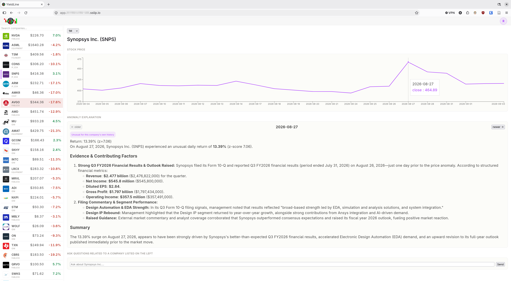
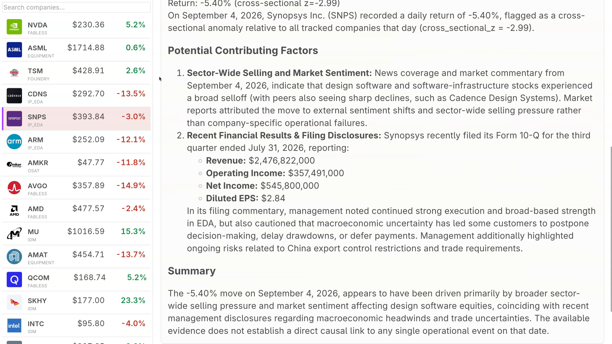
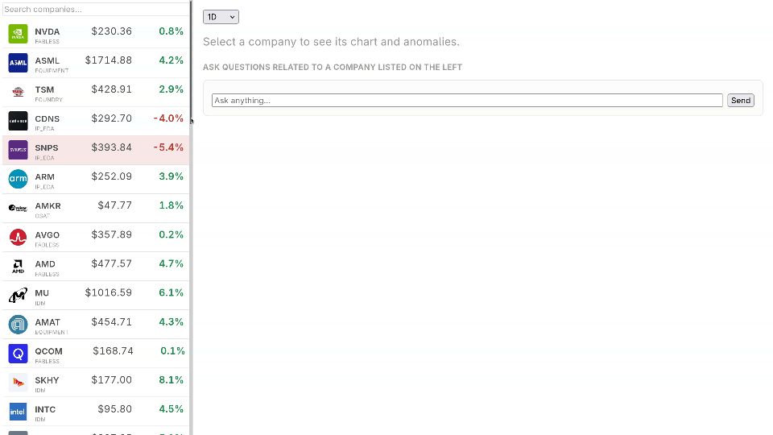
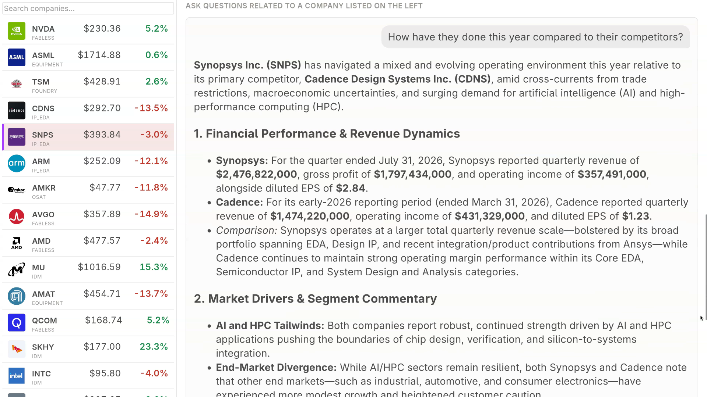
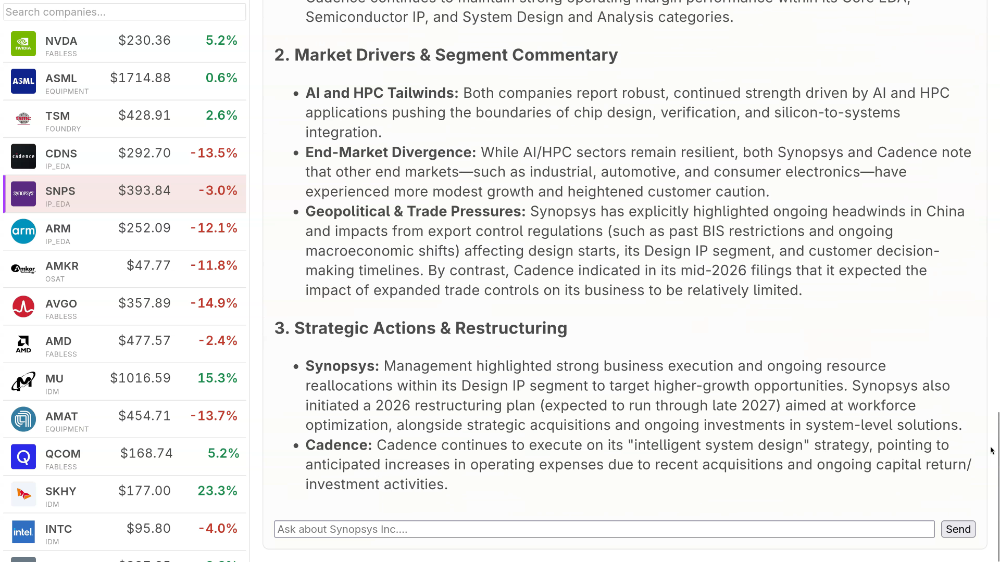
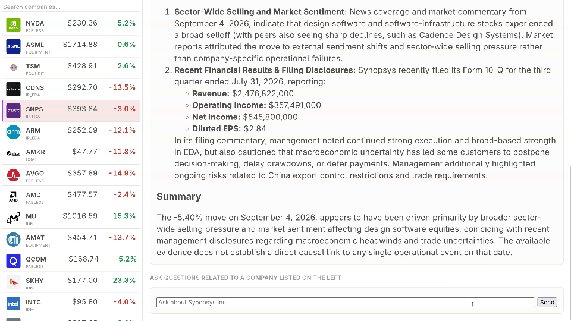
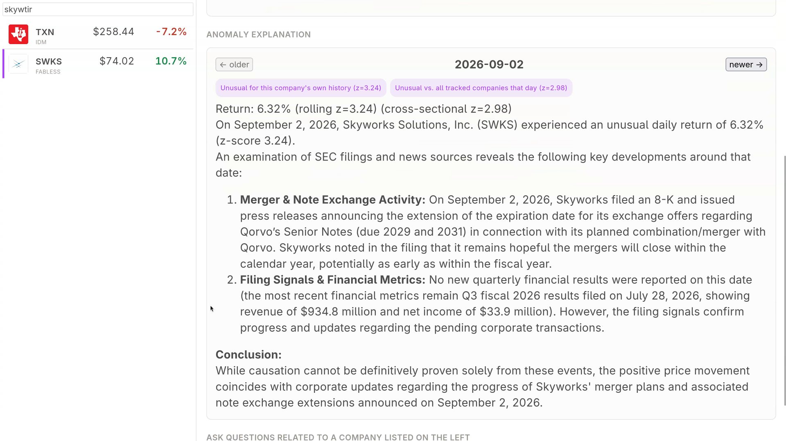
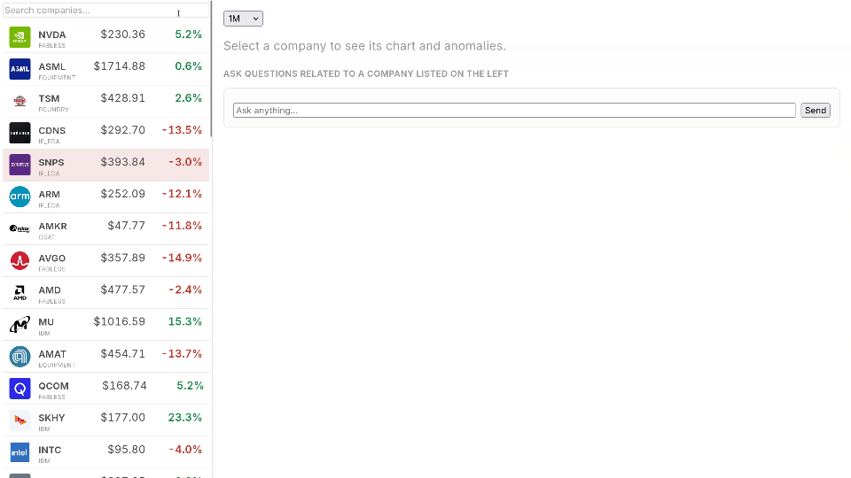
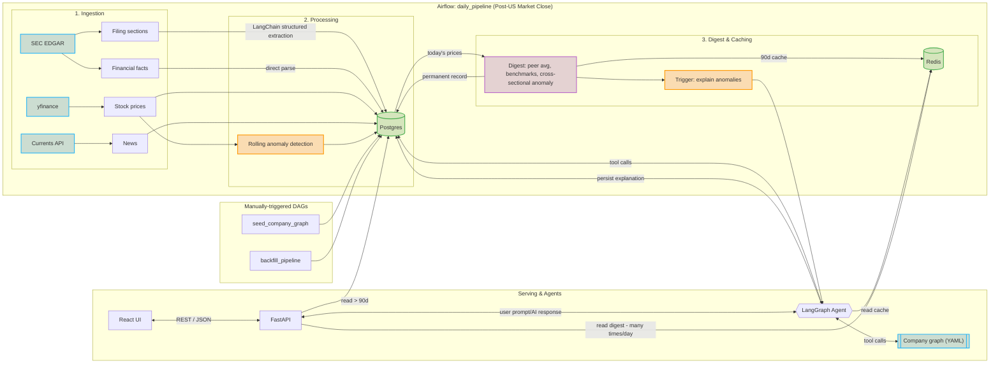
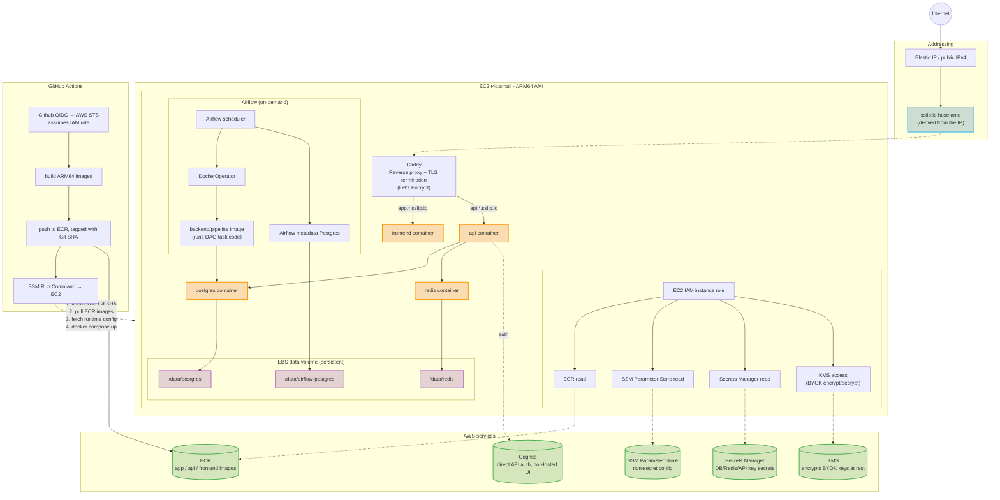

<p align="center">
  
</p>

<h1 align="center">YieldLine</h1>
<p align="center"><em>Catch unusual stock moves, uncover what drove them, and ask anything about your companies.</em></p>

[](https://opensource.org/licenses/MIT)

## Contents

- [What this is](#what-this-is)
- [Features](#features)
- [Architecture](#architecture)
- [Tech stack](#tech-stack)
- [Running locally](#running-locally)
  - [Starting the app](#starting-the-app)
  - [Editing the company graph](#editing-the-company-graph)
  - [Backfilling historical data](#backfilling-historical-data)
  - [API testing](#api-testing)
- [Known limitations / open work](#known-limitations-%2F-open-work)

## What this is

I used to check the stock market most days and repeat the same cycle: scan a handful of companies I care about, and whenever something moved more than expected, dig around manually to figure out why - earnings release, external events, or a competitor's earnings call.

YieldLine automates that loop. It tracks a curated graph of companies (currently semiconductor/adjacent-tech - nothing about the design is specific to that sector), ingests filings, prices, and related news daily, flags statistically unusual price moves, and uses an LLM agent to explain *why*, grounded in the company's own filings, recent news, and its relationships to other tracked companies (suppliers, competitors, customers).

The companies are shown in the left pane, with a fuzzy search query to filter, and the main screen shows information regarding the selected company. At the top, the drop-down menu selects a timeframe, which updates the returns of the left pane to and the stock price chart to that range. Below the price chart are 2 sections: one to view anomaly explanations and another to ask questions to the agent. More details show in [Features](#features).

<p align="center">
  
</p>

## Features

**Anomaly highlighting and explanations** - companies with an unusual price move are flagged directly in the list with a red highlight (price drop) or green highlight (price hike). Selecting one shows the agent-generated explanation, tagged by which of the 2 detectors triggered (price anomaly according to their own-history and/or compared to all other tracked companies in the app - cross-sectional). Another timeframe can be selected, in this case 1D was changed to 1M, so the returns on the company list are updated to that period and the stock price chart is also updated to show that period.

| Screenshot | Video |
| --- | --- |
|  |  |

**Agent chat with automatic company context** - asking a comparative question with a company selected, the agent resolves it, identifies its competitor via the company graph, and pulls financial data and signals for both sides before answering - no need to name the selected company nor the competitor explicitly.

| Screenshot | Video |
| --- | --- |
| <br> |  |

**Fuzzy company search and anomaly history** - searching a misspelled ticker still resolves correctly. Once a company is selected, older anomalies remain browsable, each labeled with which signals flagged it that day.

| Screenshot | Video |
| --- | --- |
|  |  |

## Architecture

One Airflow DAG (`daily_pipeline`, scheduled after US market close) handles filings, prices, news, extraction, and anomaly detection end to end, skipping anything already processed. Two additional manually-triggered DAGs handle one-time setup: seeding the company graph from YAML, and backfilling historical filings/prices for newly added companies.


```mermaid
flowchart LR
    subgraph Airflow["Airflow: daily_pipeline (Post-US Market Close)"]
        direction LR
        subgraph Ingestion["1. Ingestion"]
            EDGAR[SEC EDGAR] --> XBRL[Financial facts]
            EDGAR --> Sections[Filing sections]
            YF[yfinance] --> Prices[Stock prices]
            NewsAPI[Currents API] --> NewsData[News]
        end

        subgraph Processing["2. Processing"]
            Sections -->|"LangChain structured extraction"| PG[(Postgres)]
            XBRL -->|"direct parse"| PG
            Prices --> PG
            NewsData --> PG
            Prices --> Rolling[Rolling anomaly detection] --> PG
        end

        subgraph Analytics["3. Digest & Caching"]
            PG -->|"today's prices"| Digest[Digest: peer avg, benchmarks, cross-sectional anomaly]
            Digest -->|"permanent record"| PG
            Digest -->|"90d cache"| Redis[(Redis)]
            Digest --> AutoExplain[Trigger: explain anomalies]
        end
    end

    subgraph OneOff["Manually-triggered DAGs"]
        Seed[seed_company_graph] --> PG
        Backfill["backfill_pipeline"] --> PG
    end

    CompanyGraph[["Company graph (YAML)"]]

    subgraph Serving["Serving & Agents"]
        direction TB
        Frontend[React UI]
        API[FastAPI]
        Agent{{LangGraph Agent}}

        %% Force vertical hierarchy
        Frontend <-->|"REST / JSON"| API
        API <-->|"user prompt/AI response"| Agent

        %% Subgraph-internal layout anchors
        AutoExplain --> Agent
        Agent <-->|"tool calls"| PG
        Agent -->|"read cache"| Redis
        Agent <-->|"tool calls"| CompanyGraph
        Agent -->|"persist explanation"| PG

        API -->|"read > 90d"| PG
        API -->|"read digest - many times/day"| Redis
    end

    %% GitHub Safe Theme-Adaptive Alpha Colors
    classDef dbStyle fill:#2e7d3233,stroke:#4caf50,stroke-width:2px;
    classDef anomalyStyle fill:#e6510033,stroke:#ff9800,stroke-width:2px;
    classDef digestStyle fill:#7b1fa233,stroke:#ba68c8,stroke-width:2px;
    classDef inputStyle fill:#01579b33,stroke:#29b6f6,stroke-width:2px;

    %% Apply Styles
    class PG,Redis dbStyle;
    class Rolling,AutoExplain anomalyStyle;
    class Digest digestStyle;
    class EDGAR,YF,NewsAPI,CompanyGraph inputStyle;
```

- **Ingestion & Processing** - filings are classified and parsed into structured fields (guidance, named customers/competitors, capex commentary) via LangChain + Gemini, rate-limited against the free-tier API quota. The remaining data is parsed more directly.
- **Anomaly detection** - Two independent types of stock price anomalies are persisted, a rolling z-score against each company's own history and a same-day cross-sectional z-score against all tracked companies.
- **Digest** - daily cross-company snapshot: each company's return vs. its industry peers and sector benchmarks (SOXX/SMH/SPY), cached in Redis with a Postgres fallback beyond the cache window.
- **Agent** - one LangGraph agent calls tools to acess filings, news and prices in the database, and a tool to access the company graph. It's used two ways: automatically to explain newly detected anomalies, and interactively via the frontend's chat, where it also picks up whichever company is currently selected in the UI.
- **API / Frontend** - FastAPI (OpenAPI-documented) and a minimal React UI.


```mermaid
flowchart TB
    subgraph DNS["Addressing"]
        EIP["Elastic IP / public IPv4"]
        SSLIP["sslip.io hostname<br/>(derived from the IP)"]
        EIP --> SSLIP
    end

    Internet((Internet))

    Internet --> EIP

    subgraph EC2Host["EC2 t4g.small - ARM64 AMI"]
        direction LR

        subgraph IAM[" "]
            direction TB

            IAMRole["EC2 IAM instance role"]
            IAMRole --> ECRRead["ECR read"]
            IAMRole --> SSMRead["SSM Parameter Store read"]
            IAMRole --> SecretsRead["Secrets Manager read"]
            IAMRole --> KMSAccess["KMS access<br/>(BYOK encrypt/decrypt)"]
        end

        subgraph Runtime[" "]
            direction TB

            Caddy["Caddy<br/>Reverse proxy + TLS termination<br/>(Let's Encrypt)"]

            Caddy -->|"app.*.sslip.io"| Frontend["frontend container"]
            Caddy -->|"api.*.sslip.io"| API["api container"]

            API --> Postgres["postgres container"]
            API --> Redis["redis container"]

            subgraph AirflowOnDemand["Airflow (on-demand)"]
                direction TB
                AirflowScheduler["Airflow scheduler"]
                AirflowPG["Airflow metadata Postgres"]
                AirflowScheduler --> DockerOperator["DockerOperator"]
                DockerOperator --> BackendImage["backend/pipeline image<br/>(runs DAG task code)"]
                AirflowScheduler --> AirflowPG
            end

            BackendImage --> Postgres

            subgraph DataVolume["EBS data volume (persistent)"]
                direction LR
                PGPath["/data/postgres"]
                AirflowPGPath["/data/airflow-postgres"]
                RedisPath["/data/redis"]
            end

            Postgres --> PGPath
            AirflowPG --> AirflowPGPath
            Redis --> RedisPath
        end
    end

    SSLIP -.-> Caddy

    subgraph AWSServices["AWS services"]
        direction LR

        ECR[("ECR<br/>app / api / frontend images")]
        SSM[("SSM Parameter Store<br/>non-secret config")]
        SecretsMgr[("Secrets Manager<br/>DB/Redis/API key secrets")]
        KMS[("KMS<br/>encrypts BYOK keys at rest")]
        Cognito[("Cognito<br/>direct API auth, no Hosted UI")]
    end

    EC2Host ~~~ AWSServices

    ECRRead -.-> ECR
    SSMRead -.-> SSM
    SecretsRead -.-> SecretsMgr
    KMSAccess -.-> KMS
    API -.->|"auth"| Cognito

    subgraph CI["GitHub Actions"]
        direction TB
        OIDC["Github OIDC → AWS STS<br/>assumes IAM role"]
        Build["build ARM64 images"]
        Push["push to ECR, tagged with Git SHA"]
        Trigger["SSM Run Command → EC2"]

        OIDC --> Build --> Push --> Trigger
    end

    Trigger -.->|"1. fetch exact Git SHA\n2. pull ECR images\n3. fetch runtime config\n4. docker compose up"| EC2Host
    Push --> ECR


    %% GitHub Safe Theme-Adaptive Alpha Colors
    classDef dbStyle fill:#2e7d3233,stroke:#4caf50,stroke-width:2px;
    classDef anomalyStyle fill:#e6510033,stroke:#ff9800,stroke-width:2px;
    classDef digestStyle fill:#7b1fa233,stroke:#ba68c8,stroke-width:2px;
    classDef inputStyle fill:#01579b33,stroke:#29b6f6,stroke-width:2px;

    %% AWS services — DB-style green
    class ECR,SSM,SecretsMgr,KMS,Cognito dbStyle;

    %% Application containers — anomaly-style orange
    class Frontend,API,Postgres,Redis anomalyStyle;

    %% Persistent data mount paths — digest-style purple
    class PGPath,AirflowPGPath,RedisPath digestStyle;

    %% External addressing input — input-style blue
    class SSLIP inputStyle;
```

## Tech stack

**Backend:** Python · FastAPI · Uvicorn · SQLAlchemy · Alembic · Pydantic  
**AI / Agent frameworks:** LangChain · LangGraph  
**Data & Storage:** PostgreSQL · Redis  
**Data Pipelines:** Apache Airflow  
**Infrastructure & Testing:** Docker · Pytest  
**Frontend:** React · TypeScript · Vite  

## Running locally

1. Copy `.env.example` to `.env` and fill in the required keys and variables. Do the same for `backend/api/.env.example` and `airflow/.env.example`.

2. **Quick start:** run `make setup` to do everything below in one go - start Postgres/Redis, build the app and API images, run database migrations, seed the company graph, start Airflow, and install frontend dependencies. If that works, skip to [Starting the app](#starting-the-app).

3. **Backend:** Build and run all the necessary docker images and containers by running the following:

    ```bash
    make app-image dev-rebuild && cd airflow; docker compose up -d --build; cd ..
    ```

    This should start Postgres, Redis, the FastAPI backend (served by Uvicorn), and Airflow.

    Before the backend can serve requests, apply database migrations:

    ```bash
    cd backend && uv run alembic upgrade head && cd ..
    ```

4. **Seed the company graph** - required once against a fresh database, since nothing else populates it. Seed it either way:

   - `make sync-companies` - fastest, runs directly against your local environment.
   - Trigger the `seed_company_graph` DAG from the Airflow UI - same underlying operation, but runs as a container and is visible in Airflow's run history/logs.

    Both are idempotent (safe to re-run) and do the exact same upsert.

5. **Frontend:** install dependencies:

    ```bash
    cd frontend && npm install && cd ..
    ```

### Starting the app

Once everything above has been set up at least once, use this to start (or restart) the app - no rebuild needed unless dependencies or Docker images have changed:

```bash
make api-up
cd frontend && npm run dev
```

This starts the Uvicorn API and Vite development server. Once running, the FastAPI documentation is available at `http://localhost:8000/docs`.

### Editing the company graph

To add, remove, or edit tracked companies and their relationships, edit `backend/src/stock_news/graph/companies_graph.yaml`, then re-seed with either `make sync-companies` or the `seed_company_graph` DAG (see step 4 above) - this needs to be re-run to apply the YAML changes and populate the Postgres DB.

### Backfilling historical data

The daily DAG will run automatically from this point onwards. To have historical data available immediately and use the app with more context, manually trigger the backfill DAG through the Airflow UI.

The `BACKFILL_YEARS` variable in `airflow/dags/backfill_pipeline.py` controls how many years of data are requested. It is set to `1` by default and can be increased.

Note that the [SEC EDGAR submissions API](https://www.sec.gov/search-filings/edgar-application-programming-interfaces) provides at least 1 year of filing history or 1,000 filings, whichever is greater. In practice, most companies appear to have considerably more than one year available because 1,000 filings within a single year is a large number. Five years will likely cover most companies, but companies with less available history simply will not have data for the full requested period.

### API testing

A Bruno API client collection is included in `bruno/` for exercising both the application's API and the external EDGAR and Currents News APIs directly.

## Known limitations / open work

Tracked as open issues:

- **AWS migration** - currently local-only (docker-compose); MWAA/ECS/RDS migration is scoped but not started.
- **Bring-your-own API key** - currently uses a single shared LLM key; supporting per-user keys is planned.
- **Pending-edges automation** - filings mention customers/competitors not yet in the graph; promoting those into tracked relationships is still a manual review step.
- **6-K classification** - not yet implemented (foreign private issuers' interim filings).
- **FX conversion** - non-USD reported financials aren't yet normalized to USD for cross-company comparison.
- **News dedup precision** - cross-outlet duplicate articles and company-relevance matching could be tighter.

## Disclaimer

Company names and logos are used solely to identify the companies represented in the application and remain the property of their respective owners. YieldLine is not affiliated with or endorsed by any company displayed.

YieldLine is provided for informational and educational purposes only and does not constitute financial or investment advice.
